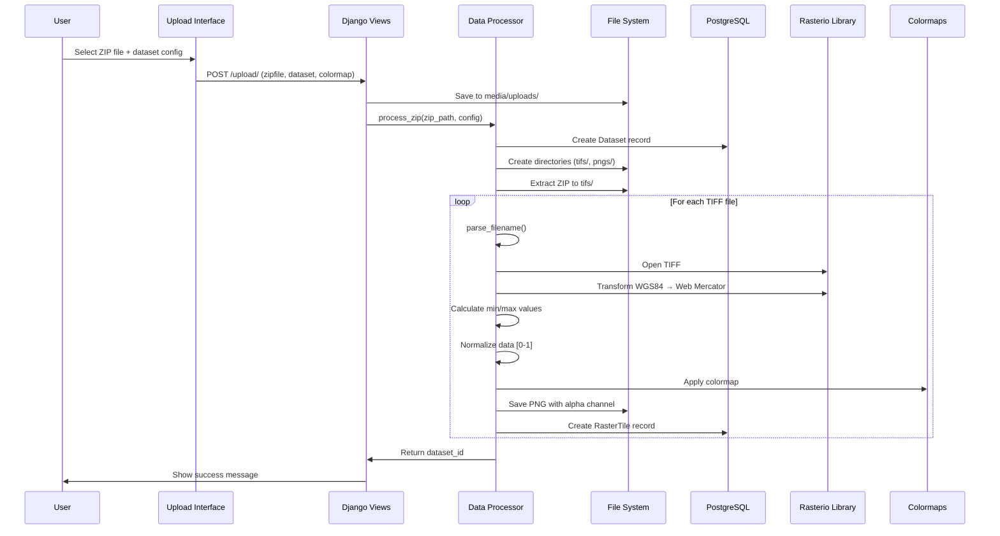
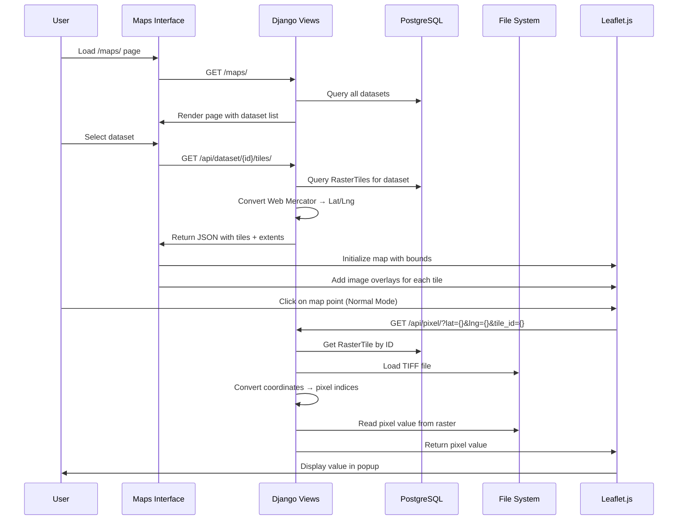
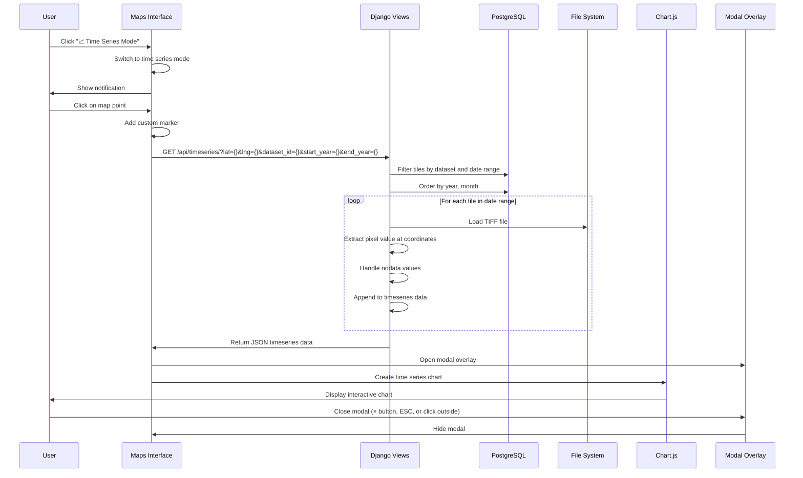
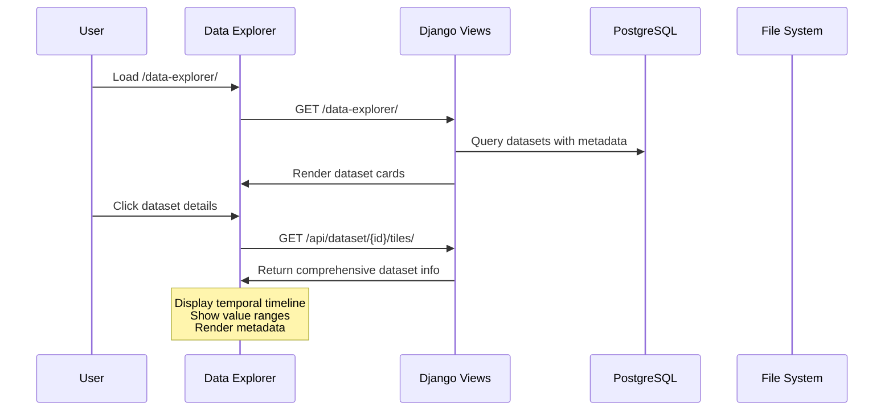
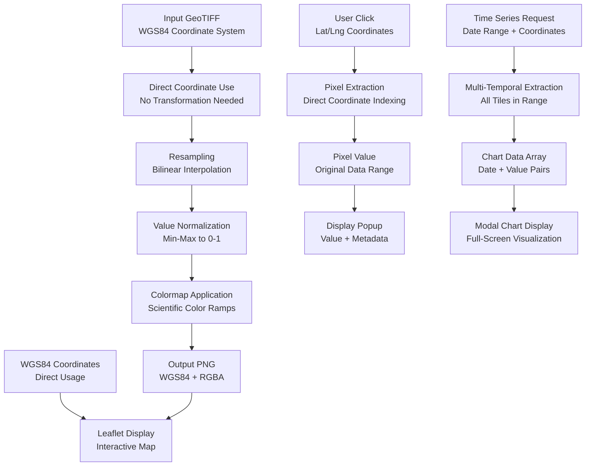

# SDG Tunisia Geoportal - Current Pipeline Schema (Updated)

## 🗺️ System Architecture Overview

```mermaid
graph TB
    subgraph "User Interface Layer"
        UI[Web Frontend<br/>Leaflet.js + HTML/CSS]
        Upload[Upload Interface]
        Maps[Interactive Maps]
        Explorer[Data Explorer]
        TimeSeries[Time Series Analysis<br/>Modal Charts]
        Notifications[Toast Notifications]
    end
    
    subgraph "Django Application Layer"
        subgraph "URL Routing"
            Root[geoportal/urls.py]
            App[SDGtunisia/urls.py]
        end
        
        subgraph "View Controllers"
            Views[views.py<br/>- map_view<br/>- get_pixel_value<br/>- dataset_tiles_json<br/>- timeseries<br/>- upload_view]
        end
        
        subgraph "Business Logic"
            Processor[processor.py<br/>- process_zip<br/>- parse_filename<br/>- raster transformation]
            Colormaps[colormaps.py<br/>- 20+ scientific colormaps]
        end
    end
    
    subgraph "Data Layer"
        subgraph "Database Models"
            Dataset[(Dataset<br/>name, colormap, created_at)]
            RasterTile[(RasterTile<br/>extent, dimensions, temporal data)]
        end
        
        subgraph "File Storage"
            TIF[Original TIFF Files<br/>media/datasets/{name}/tifs/{name}/]
            PNG[Rendered PNG Files<br/>media/datasets/{name}/pngs/]
            Uploads[Temporary Uploads<br/>media/uploads/]
        end
        
        subgraph "Database"
            PostgreSQL[(PostgreSQL<br/>- Spatial indexing<br/>- Metadata storage)]
        end
    end
    
    UI --> Root
    Upload --> Views
    Maps --> Views
    Explorer --> Views
    TimeSeries --> Views
    Notifications --> Views
    
    Root --> App
    App --> Views
    
    Views --> Dataset
    Views --> RasterTile
    Views --> Processor
    Views --> TIF
    Views --> PNG
    
    Processor --> Colormaps
    Processor --> TIF
    Processor --> PNG
    Processor --> Dataset
    Processor --> RasterTile
    
    Dataset --> PostgreSQL
    RasterTile --> PostgreSQL
```

## 🔄 Complete Data Flow Scenarios

### Scenario 1: Dataset Upload & Processing Pipeline



### Scenario 2: Interactive Map Visualization



### Scenario 3: Time Series Analysis Pipeline



### Scenario 4: Data Explorer Workflow



## 📁 Current File System Organization

```
SDG_Tunisia/
├── geoportal/
│   ├── media/
│   │   ├── datasets/
│   │   │   ├── NDVI/
│   │   │   │   ├── tifs/
│   │   │   │   │   └── NDVI/
│   │   │   │   │       ├── NDVI_Tunisia_2000_01.tif
│   │   │   │   │       ├── NDVI_Tunisia_2000_02.tif
│   │   │   │   │       └── ... (300+ files)
│   │   │   │   └── pngs/
│   │   │   │       ├── NDVI_Tunisia_2000_01.png
│   │   │   │       ├── NDVI_Tunisia_2000_02.png
│   │   │   │       └── ... (rendered visualizations)
│   │   │   ├── CDI/
│   │   │   └── LST/
│   │   └── uploads/
│   │       └── temp_zip_files.zip
│   ├── static/
│   │   ├── css/
│   │   ├── js/
│   │   └── img/
│   └── templates/
│       ├── maps.html (Enhanced with Time Series)
│       ├── upload.html
│       ├── data-explorer.html
│       └── ...
└── SDGtunisia/
    ├── models.py          # Dataset, RasterTile
    ├── views.py           # All API endpoints + timeseries
    ├── processor.py       # Data processing pipeline
    ├── colormaps.py       # 20+ scientific colormaps
    └── urls.py            # App routing + /api/timeseries/
```

## 🎨 Enhanced Colormap System Architecture

```mermaid
graph LR
    subgraph "Colormap Categories"
        Diverging[diverging<br/>red-blue anomalies]
        Sequential[sequential<br/>ndvi, lst, sm]
        Qualitative[qualitative<br/>terrain, risk]
        Scientific[scientific<br/>viridis, plasma, inferno]
    end
    
    subgraph "Colormap Application"
        Input[Normalized Data<br/>0.0 - 1.0]
        Interpolation[Linear Interpolation<br/>between color stops]
        Output[RGB Array<br/>uint8 [0-255]]
    end
    
    Diverging --> Interpolation
    Sequential --> Interpolation
    Qualitative --> Interpolation
    Scientific --> Interpolation
    
    Input --> Interpolation
    Interpolation --> Output
```

## 🔧 Current Technical Stack Details

### Backend Technologies
- **Django 5.1.1**: Web framework
- **PostgreSQL**: Spatial database
- **Rasterio**: Geospatial raster I/O
- **PROJ**: Coordinate transformations
- **NumPy**: Numerical computations
- **PIL/Pillow**: Image processing

### Frontend Technologies
- **Leaflet.js**: Interactive mapping
- **Chart.js**: Time series visualization
- **Bootstrap**: UI components
- **Custom CSS**: Responsive design
- **JavaScript ES6+**: Client-side logic

### Enhanced Features
- **Modal Overlays**: Full-screen chart display
- **Toast Notifications**: Non-intrusive user feedback
- **Mode Switching**: Normal vs Time Series modes
- **Custom Markers**: Styled time series points
- **Responsive Design**: Mobile-friendly interface

### Data Processing Pipeline
1. **Input**: ZIP file with GeoTIFFs
2. **Parsing**: Filename → temporal metadata
3. **Coordinate System**: WGS84 (no transformation needed)
4. **Normalization**: Min-max scaling to [0,1]
5. **Colormapping**: Scientific color ramps
6. **Output**: PNG with alpha transparency

## 🌍 Geographic Data Flow



## 🔍 Current API Endpoint Matrix

| Endpoint | Method | Purpose | Input | Output |
|----------|--------|---------|-------|--------|
| `/upload/` | POST | Process ZIP dataset | zipfile, dataset, colormap | Dataset ID |
| `/api/dataset/<id>/latest/` | GET | Get latest tile | dataset_id | Tile metadata + PNG URL |
| `/api/dataset/<id>/tiles/` | GET | Get all tiles | dataset_id | Tiles array + dataset info |
| `/api/pixel/` | GET | Extract pixel value | lat, lng, tile_id | Pixel value or error |
| `/api/timeseries/` | GET | **NEW** Time series data | lat, lng, dataset_id, date range | Time series JSON |
| `/maps/` | GET | Interactive map | - | HTML + dataset list |
| `/data-explorer/` | GET | Dataset catalog | - | HTML + dataset cards |

## 🚀 Performance & UX Enhancements

### Caching Strategy
- **Static PNGs**: Pre-rendered and cached
- **Database queries**: Optimized with indexes
- **Coordinate transformations**: Eliminated (direct WGS84 usage)

### UX Improvements Implemented
- **Modal Charts**: Full-screen time series display
- **Toast Notifications**: Non-blocking user feedback
- **Mode Switching**: Clear visual state indicators
- **Custom Markers**: Professional time series points
- **Responsive Design**: Mobile-compatible interface

### Error Handling
- **Graceful Degradation**: Missing data scenarios
- **User-Friendly Messages**: Clear error notifications
- **Network Resilience**: Timeout and retry handling
- **Validation**: Input sanitization and bounds checking

## 🛡️ Security & Error Handling

### Current Security Measures
- **File Type Validation**: ZIP upload restrictions
- **Coordinate Bounds**: Tunisia extent validation
- **Path Sanitization**: Secure file access
- **SQL Injection Protection**: Django ORM usage

### Error Scenarios Handled
- **Invalid Coordinates**: "Outside raster" response
- **Missing Files**: 404 with descriptive error
- **Processing Failures**: Graceful error recovery
- **Network Issues**: User-friendly error messages

## 📊 Current System Capabilities

### Data Processing
- **300+ Time Series Points**: Multi-year temporal coverage
- **Multiple Indices**: NDVI, CDI, LST support
- **Scientific Visualization**: 20+ colormap options
- **Efficient Storage**: Dual format (TIF + PNG)

### Interactive Features
- **Real-time Pixel Inspection**: Click-to-extract values
- **Temporal Analysis**: Time series chart generation
- **Multi-dataset Support**: Switch between different indices
- **Responsive Visualization**: Mobile and desktop compatible

### User Experience
- **Professional UI**: Modern gradients and animations
- **Intuitive Navigation**: Clear mode switching
- **Fast Performance**: Optimized data loading
- **Comprehensive Feedback**: Toast notifications and status updates

## 🎯 Current System Status

**Production Ready**: ✅ All core features functional
**Scalable Architecture**: ✅ Handles large datasets efficiently
**User-Friendly Interface**: ✅ Professional UX with modal charts
**Robust Error Handling**: ✅ Graceful failure management
**Mobile Compatible**: ✅ Responsive design implementation

The system now provides a complete geospatial analysis platform with advanced time series capabilities, professional visualization, and excellent user experience.
